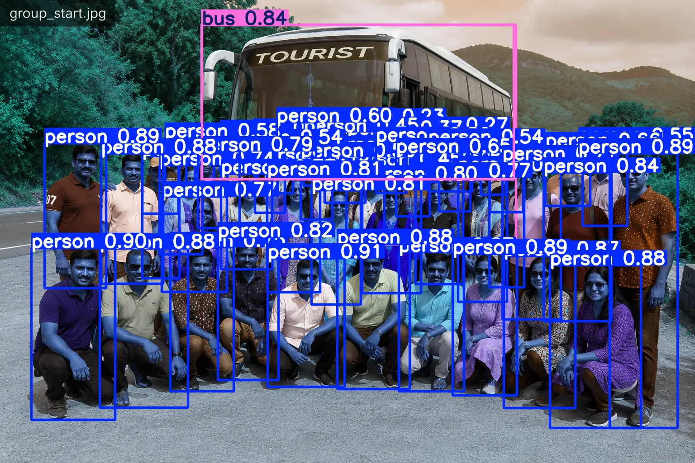
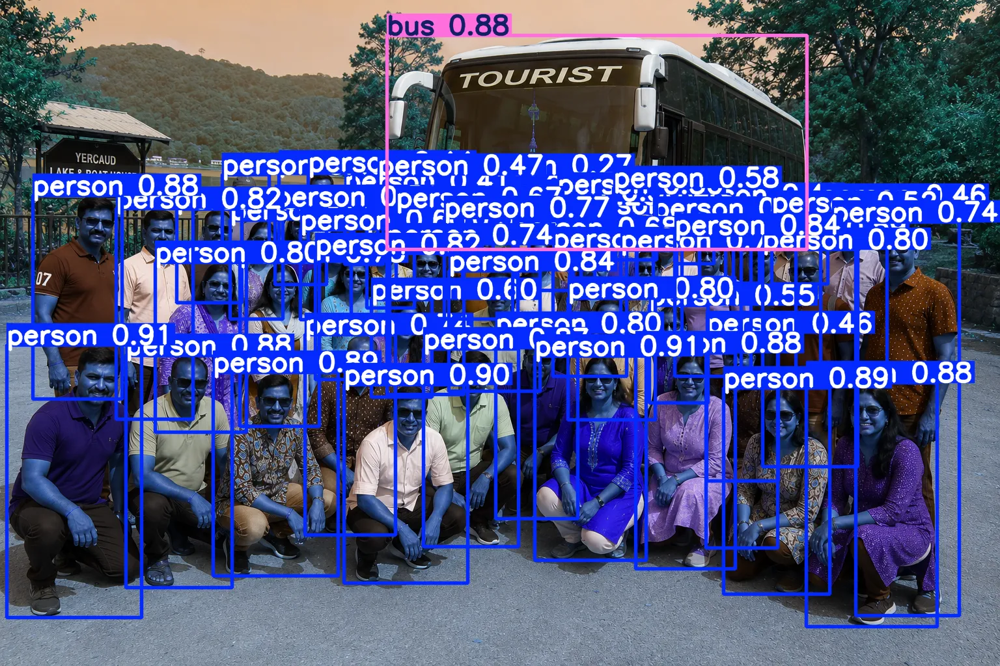

https://colab.research.google.com/drive/1jjLoX5L-KbnCCpYgWKDtCGTKEXfq8kLJ#scrollTo=xzVxA-rvKf6E

==========

# TourGuard AI

AI-Based Tourist Verification System using YOLO11 and Gradio.

# Problem Statement

Tour operators and travel agencies frequently face challenges in verifying whether all tourists 
have returned after visiting tourist destinations such as temples, waterfalls, parks, historical monuments, and restaurants.

Currently, tour guides manually count passengers at every stop, which can be:

- Time-consuming
- Error-prone
- Stressful for tour guides
- Difficult for large groups
- Risky if a tourist is accidentally left behind

TourGuard AI solves this problem by automatically counting tourists from group photos using YOLO11 object detection 
and comparing the current tourist count with the original tour count. 
The system instantly identifies missing or extra persons and generates a verification report.


# Project Workflow

Tour Start Photo
→ YOLO11 Person Detection
→ Expected Tourist Count
→ Current Group Photo
→ YOLO11 Person Detection
→ Current Tourist Count
→ Compare Counts
→ Missing / Extra Tourist Detection
→ Alert Generation

---

## Start Group Detection Output



---

## Current Group Detection Output



---

## Features

- Tourist Counting
- Missing Tourist Detection
- Extra Person Detection
- YOLO11 Object Detection
- Gradio User Interface

---

## Installation

```bash
pip install -r requirements.txt
```

## Run

```bash
python tourguard_ai.py
```

## Sample Result

```text
Expected Tourists : 51

Current Tourists : 56

Missing Tourists : 0

Extra Persons : 5

Status : ALERT - Extra Persons Detected : 5
```

==================

# TourGuard AI

AI-Based Tourist Verification System

Features:
- Tourist Counting
- Missing Tourist Detection
- Extra Person Detection
- YOLO11 Object Detection
- Gradio Interface

Run:

pip install -r requirements.txt

python tourguard_ai.py
